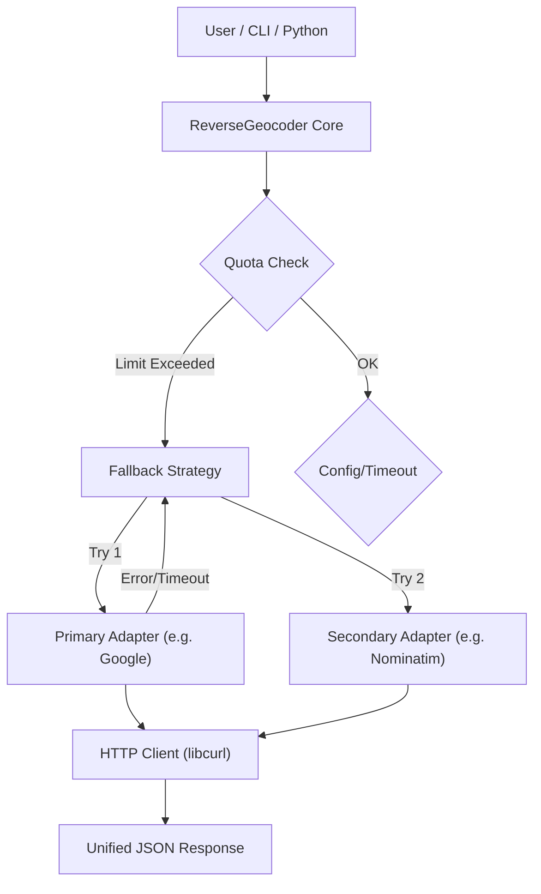

# re-geocode

Reverse Geocoding Library designed for high-availability applications. It unifies multiple providers (Google, OSM, OpenCage, Bing, etc.) and specialized information services (Weather, Tides, Pollution)

[](https://opensource.org/licenses/MIT)
[]()
[]()

[](https://github.com/Zheng-Bote/geocoding/releases)

[Report Issue](https://github.com/Zheng-Bote/geocoding/issues) · [Request Feature](https://github.com/Zheng-Bote/geocoding/pulls)

---

<!-- START doctoc generated TOC please keep comment here to allow auto update -->
<!-- DON'T EDIT THIS SECTION, INSTEAD RE-RUN doctoc TO UPDATE -->
<!-- END doctoc generated TOC please keep comment here to allow auto update -->

---

## Description

A modern, resilient **C++23 Reverse Geocoding Library** designed for high-availability applications. It unifies multiple providers (Google, OSM, OpenCage, Bing, etc.) and specialized information services (Weather, Tides, Pollution) into a single, robust interface.

It features **automatic fallback strategies (Circuit Breaker)**, **asynchronous batch processing**, **daily quota management**, and a **standardized JSON output format**.

## 🚀 Key Features

- **Multi-Provider Support**: Seamlessly switch between Nominatim, Google Maps, OpenCage, Bing (Azure), and more.
- **Resilience & Reliability**:
  - **Circuit Breaker / Fallback Chain**: Automatically switches to the next provider if one fails or times out.
  - **Daily Quota Management**: Persistently tracks API usage to prevent over-billing (e.g., stops Google requests after 1000 calls).
  - **Timeouts**: Configurable HTTP timeouts per provider.
- **High Performance**:
  - **C++23 Core**: Built for speed and safety.
  - **Async Batch Processing**: Resolve thousands of coordinates in parallel using `std::future` and multi-threading.
- **Unified Data Model**:
  - **Geocoding**: Standardized address fields + raw attributes.
  - **Info-Layers**: Support for Weather, Pollution, Tides, Timezones, and Wikipedia.
  - **JSON Output**: Full access to all data via a standardized JSON structure.
- **Interoperability**: C-API for integration with Python, Rust, C, etc.

---

## 🏗 Architecture

The library separates the **Core Logic** (Flow Control, Quota, Configuration) from the specific **API Adapters**.



### Supported Adapters

| Adapter     | Type      | Description                                 |
| ----------- | --------- | ------------------------------------------- |
| Nominatim   | geocoding | OpenStreetMap (Free, Fair Use Policy)       |
| Google      | geocoding | Google Maps Platform (High precision, Paid) |
| OpenCage    | geocoding | OpenCage Geocoder (Reliable, Tiered)        |
| Bing        | geocoding | Microsoft Azure Maps (Enterprise)           |
| Timezone    | info      | GeoNames Timezone data                      |
| Wikipedia   | info      | Nearby Wikipedia articles                   |
| OpenWeather | info      | Current weather data                        |
| Pollution   | info      | Air quality index (AQI) and components      |
| Tides       | info      | Tide predictions (High/Low tides)           |
| SeaWeather  | info      | Maritime weather (Wave height, Water temp)  |

## 🛠 Build and Installation

### Prerequisites

- C++ Compiler: GCC 13+, Clang 16+, or MSVC 19.36+ (C++23 support required).
- CMake: 3.25+

### Dependencies

- libcurl (dev).
- Fetched automatically: nlohmann/json, inicpp, CLI11, inja.

### Building from Source

```bash
mkdir build && cd build
cmake .. -DCMAKE_BUILD_TYPE=Release
make -j$(nproc)
```

### Installation

```bash
sudo make install
```

This installs libregeocode.so (Shared Lib), headers, and the regeocode-cli tool.

### ⚙️ Configuration (INI)

The library is fully configuration-driven. You can define timeouts, limits, and templates without recompiling.

re-geocode.ini example:

```ini
[config]
# Path to store the daily usage counter
quota-file = quota_status.json
type = config

[strategies]
# Define a fallback chain
default = nominatim, google, opencage
type = strategies

[nominatim]
URI = [https://nominatim.openstreetmap.org/reverse?lat=](https://nominatim.openstreetmap.org/reverse?lat=){{ latitude }}&lon={{ longitude }}&format=json&accept-language={{ lang }}
API-Key = none
Adapter = nominatim
daily-limit = 0       ; 0 = unlimited
timeout = 60          ; Seconds
type = geocoding

[google]
URI = [https://maps.googleapis.com/maps/api/geocode/json?latlng=](https://maps.googleapis.com/maps/api/geocode/json?latlng=){{ latitude }},{{ longitude }}&key={{ apikey }}&language={{ lang }}
API-Key = YOUR_KEY
Adapter = google
daily-limit = 1000    ; Stop after 1000 requests/day
timeout = 10
type = geocoding

[tides]
URI = [https://api.marea.ooo/v1/tides?latitude=](https://api.marea.ooo/v1/tides?latitude=){{ latitude }}&longitude={{ longitude }}
API-Key = YOUR_KEY
Adapter = tides
type = info
```

## 💻 Usage Examples

### 1. Command Line Interface (CLI)

Single Lookup with specific API:

```bash
regeocode-cli --lat 48.137 --lon 11.576 --api google
```

#### Using a Fallback Strategy

If Nominatim fails, it automatically tries Google, then OpenCage.

```bash
regeocode-cli --lat 48.137 --lon 11.576 --strategy "nominatim, google, opencage"
```

#### Batch Processing

Process multiple coordinates in parallel (simulated list in CLI demo).

```bash
regeocode-cli --batch --strategy "nominatim"
```

### 2. C++ API

```cpp
#include <regeocode/re_geocode_core.hpp>
#include <iostream>

int main() {
    // 1. Load Configuration
    regeocode::ConfigLoader loader("re-geocode.ini");
    auto config_data = loader.load();

    // 2. Setup Adapters & Geocoder
    std::vector<regeocode::ApiAdapterPtr> adapters;
    // ... push_back adapters ...

    regeocode::ReverseGeocoder geocoder(
        std::move(config_data.apis),
        std::move(adapters),
        std::make_unique<regeocode::HttpClient>(),
        config_data.quota_file_path
    );

    // 3. Robust Lookup with Fallback
    // Tries 'google' first. If quota exceeded or down, tries 'nominatim'.
    std::vector<std::string> strategy = {"google", "nominatim"};

    auto json_result = geocoder.reverse_geocode_fallback(
        {48.137, 11.576},
        strategy,
        "de" // Language override
    );

    std::cout << json_result.dump(4) << std::endl;
    return 0;
}
```

### 3. Python Integration (via C-API)

The C-API provides access to the full JSON response, allowing easy parsing in Python.

```python
import ctypes
import json

# Define the C-Result structure
class GeocodeResult(ctypes.Structure):
    _fields_ = [
        ("address_english", ctypes.c_char_p),
        ("address_local", ctypes.c_char_p),
        ("country_code", ctypes.c_char_p),
        ("json_full", ctypes.c_char_p),  # Contains all attributes/weather data
        ("success", ctypes.c_int)
    ]

lib = ctypes.CDLL("./libregeocode.so")

# Setup signatures
lib.geocoder_new.argtypes = [ctypes.c_char_p]
lib.geocoder_new.restype = ctypes.c_void_p
lib.geocoder_lookup.argtypes = [ctypes.c_void_p, ctypes.c_double, ctypes.c_double, ctypes.c_char_p, ctypes.c_char_p]
lib.geocoder_lookup.restype = GeocodeResult
lib.geocoder_result_free.argtypes = [ctypes.POINTER(GeocodeResult)]

# Usage
geocoder = lib.geocoder_new(b"re-geocode.ini")

# Example: Fetching Tides
res = lib.geocoder_lookup(geocoder, 44.4, -2.1, b"tides", None)

if res.success:
    # Basic fields
    print(f"Summary: {res.address_english.decode('utf-8')}")

    # Full Data (Accessing attributes)
    data = json.loads(res.json_full.decode('utf-8'))
    print("Full JSON Data:", json.dumps(data, indent=2))

    # Access specific attribute
    if "result" in data and "data" in data["result"]:
        print("Water Level:", data["result"]["data"].get("current_height"))

lib.geocoder_result_free(ctypes.byref(res))
```

## 🛡 Advanced Features

### Circuit Breaker & Fallback

The reverse_geocode_fallback method iterates through a priority list of providers. It catches network errors, timeouts, and quota exceptions. It only returns an error if all providers in the list fail.

### Quota Management

The library maintains a persistent state file (default: quota_status.json).

- It tracks requests per provider per day.
- It automatically resets counters when the date changes.
- It is thread-safe for batch processing.

### Async Batching

The batch_reverse_geocode method utilizes std::async (launching threads) to process a vector of coordinates concurrently. This significantly reduces total wait time when querying APIs that support high concurrency but have high latency.

---

## 📝 License

This project is licensed under the MIT License - see the LICENSE file for details.

Copyright (c) 2026 ZHENG Robert.

## Author

[](https://www.github.com/Zheng-Bote)

### Code Contributors


---

**Happy coding! 🚀** :vulcan_salute:
