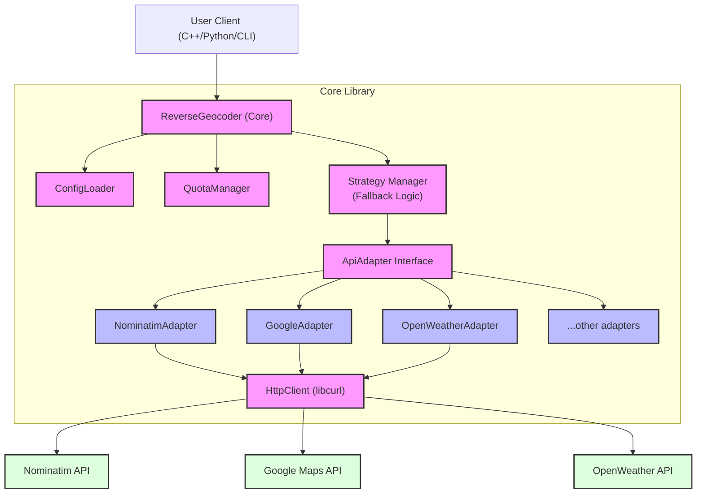

# Architecture Overview: re-geocode

The `re-geocode` library is designed to be highly resilient, extensible, and performant, leveraging modern C++23 features. The core philosophy is to decouple the business logic (flow control, quoting, fallback mechanisms) from the specific implementation details of individual API providers (Google, Nominatim, OpenWeather, etc.).

---

<!-- START doctoc generated TOC please keep comment here to allow auto update -->
<!-- DON'T EDIT THIS SECTION, INSTEAD RE-RUN doctoc TO UPDATE -->

**Table of Contents**

- [Bing Maps Adapter](#bing-maps-adapter)
  - [Details](#details)
  - [Functionality](#functionality)
    - [`name()`](#name)
    - [`parse_response(const std::string &response_body)`](#parse_responseconst-stdstring-response_body)
  - [Example](#example)

<!-- END doctoc generated TOC please keep comment here to allow auto update -->

---

## 1. High-Level Concept

The architecture follows a modular approach using the **Adapter Pattern** combined with a **Circuit Breaker** and **Quota Control**.



## 2. Core Components

### 2.1. `ReverseGeocoder` (The Facade)

This is the main entry point for the user. It orchestrates the entire lookup process. It receives the coordinates, the desired strategy (list of providers), and delegates the work.

### 2.2. `QuotaManager`

Crucial for preventing unexpected costs (e.g., with Google Maps) or being banned by free services (e.g., OSM/Nominatim).

- **Persistent State**: Reads and writes usage counts to a local JSON file (`quota_status.json`).
- **Thread-Safe**: Uses `std::mutex` to allow asynchronous batch processing without corrupting the counters.
- **Daily Reset**: Automatically detects date changes and resets quotas accordingly.

### 2.3. The Fallback Strategy (Circuit Breaker)

Instead of relying on a single provider, the user defines a "strategy" (e.g., `"nominatim, google"`).

1. The Core tries the first provider (`nominatim`).
2. If `nominatim` succeeds, the formatted JSON is returned immediately.
3. If it fails (network error, timeout, or **Quota Exceeded**), the error is caught, and the Core automatically moves to the next provider (`google`).
4. An error is only returned to the user if _all_ providers in the chain fail.

## 3. The Adapter Pattern

To add a new data source (whether it's geocoding, weather, or tides), you only need to implement the `ApiAdapter` interface.

```cpp
class ApiAdapter {
public:
    virtual ~ApiAdapter() = default;

    // Returns the unique identifier (e.g., "google")
    [[nodiscard]] virtual std::string name() const = 0;

    // The core method every adapter must implement
    [[nodiscard]] virtual std::expected<nlohmann::json, std::string>
    lookup(double lat, double lon, const std::string& language, HttpClient& http_client) const = 0;
};
```

### Why this is powerful:

- **Isolation**: Changes in the Google API only require changes in `adapter_google.cpp`, leaving the core untouched.
- **Testability**: Adapters can be mocked easily for unit testing.
- **Extensibility**: Adding a new service (e.g., a new weather provider) requires zero changes to the core logic.

## 4. Concurrency Model (`std::async`)

For batch processing (resolving thousands of coordinates), sequential processing is too slow due to network latency. The library uses C++ `std::async` to parallelize HTTP requests.

- Re-uses the thread-safe `QuotaManager`.
- Each concurrent task creates its own `HttpClient` instance (libcurl easy handles are not thread-safe).
- Returns a `std::vector<std::future<...>>` allowing the main thread to wait for all asynchronous HTTP requests to complete efficiently.

## 5. C++23 Modernities Used

- **`std::expected`**: Used extensively instead of exceptions for control flow. Network timeouts or parsing errors return a `std::unexpected("reason")`, making error handling explicit and performant.
- **`std::string_view`**: Used in function parameters to avoid unnecessary string allocations.
- **Monadic Operations**: Code utilizes `.and_then()` and `.or_else()` on `std::expected` to chain operations (like HTTP Request -> JSON Parse -> Format Mapping) cleanly without deeply nested `if` statements.
