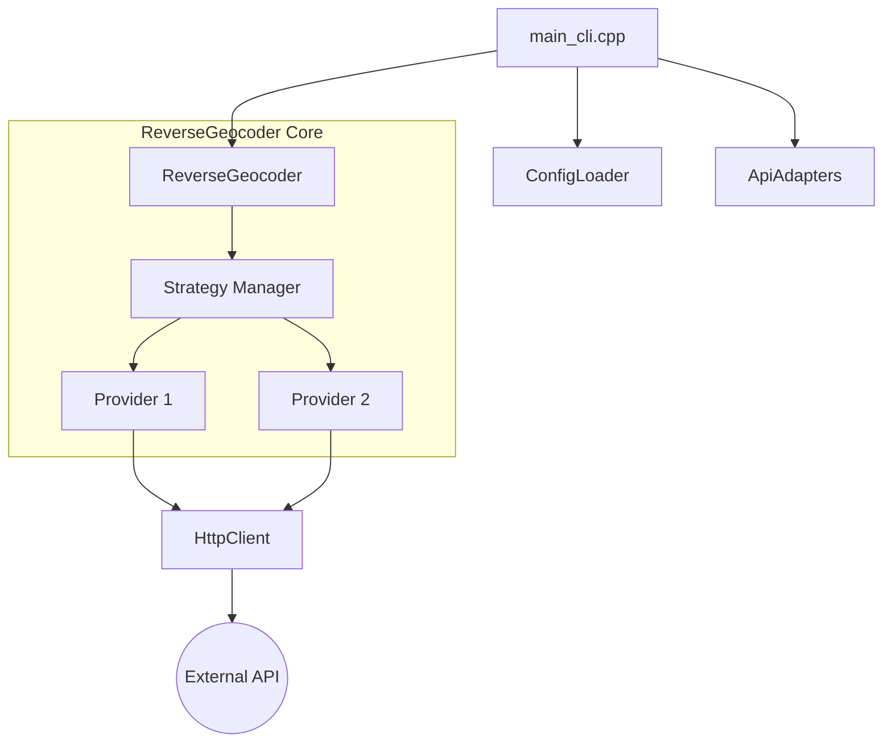

# regeocode-cli Documentation

`regeocode-cli` is the primary command-line interface for the `regeocode` library. It provides single and batch coordinate lookups with built-in support for fallback strategies and quota management.

---

<!-- START doctoc generated TOC please keep comment here to allow auto update -->
<!-- DON'T EDIT THIS SECTION, INSTEAD RE-RUN doctoc TO UPDATE -->

**Table of Contents**

- [Bing Maps Adapter](#bing-maps-adapter)
  - [Details](#details)
  - [Functionality](#functionality)
    - [`name()`](#name)
    - [`parse_response(const std::string &response_body)`](#parse_responseconst-stdstring-response_body)
  - [Example](#example)

<!-- END doctoc generated TOC please keep comment here to allow auto update -->

---

## Features

- **Single Geocoding**: Fetch address or info for one set of coordinates.
- **Batch Geocoding**: Concurrent processing of multiple coordinate sets (demo mode).
- **Strategy Selection**: Dynamically define fallback chains via the command line.
- **Provider Override**: Directly specify an API provider to use.
- **Language Support**: Override the default response language.

## Usage

```bash
# Basic usage (defaults to nominatim)
regeocode-cli --lat 48.137 --lon 11.576

# Specify an API provider
regeocode-cli --lat 48.137 --lon 11.576 --api google

# Use a custom strategy (priority chain)
regeocode-cli --lat 48.137 --lon 11.576 --strategy "google, nominatim"

# Batch demo
regeocode-cli --batch --strategy "nominatim"
```

## CLI Parameters

| Flag         | Description                                  | Default          |
| ------------ | -------------------------------------------- | ---------------- |
| `--lat`      | Latitude of the point                        | `0.0`            |
| `--lon`      | Longitude of the point                       | `0.0`            |
| `--config`   | Path to the `.ini` configuration file        | `re-geocode.ini` |
| `--strategy` | Comma-separated list of APIs to try in order | `nominatim`      |
| `--api`      | Single API name (overrides strategy)         | (empty)          |
| `--lang`     | ISO language code (e.g., `de`, `en`, `zh`)   | (empty)          |
| `--batch`    | Runs a parallelized demo batch process       | `false`          |

## Architecture

The CLI acts as a wrapper around the `ReverseGeocoder` core. It handles configuration loading, adapter registration, and output formatting.



## Data Flow

1. **Initialization**: Loads `re-geocode.ini` to discover API endpoints and keys.
2. **Setup**: Registers all available `ApiAdapter` implementations (Nominatim, Google, etc.).
3. **Execution**:
   - **Single Mode**: Calls `reverse_geocode_fallback` with user coordinates.
   - **Batch Mode**: Calls `batch_reverse_geocode` with a set of coordinates, spawning multiple threads for concurrent requests.
4. **Output**: Standardized JSON output is printed to `stdout`.
