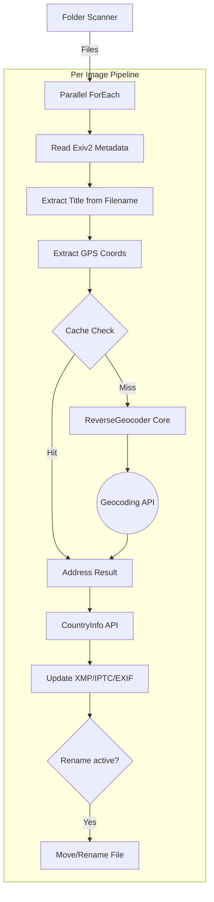

# reverse_geo_batch Documentation

`reverse_geo_batch` is a high-performance, parallelized tool for embedding reverse geocoding data and rich country information directly into image metadata (EXIF/IPTC/XMP).

---

<!-- START doctoc generated TOC please keep comment here to allow auto update -->
<!-- DON'T EDIT THIS SECTION, INSTEAD RE-RUN doctoc TO UPDATE -->

**Table of Contents**

- [reverse_geo_batch Documentation](#reverse_geo_batch-documentation)
  - [Key Features](#key-features)
  - [Usage](#usage)
  - [CLI Parameters](#cli-parameters)
  - [Architecture](#architecture)
  - [Metadata Mapping](#metadata-mapping)
    - [Primary Fields (Geocoding \& Identity)](#primary-fields-geocoding--identity)
    - [Location Detail Fields (Photoshop/IPTC Standard)](#location-detail-fields-photoshopiptc-standard)

<!-- END doctoc generated TOC please keep comment here to allow auto update -->

---

## Key Features

- **Metadata Extraction**: Reads GPS coordinates from image EXIF data.
- **Automatic Title**: Extracts the filename (e.g., `Hotel_Xian.jpg`), replaces underscores, and writes it to `Xmp.dc.title` (e.g., `Hotel Xian`).
- **Rich Country Metadata**: Integrates with the `CountryInfoAdapter` (RestCountries) to embed:
  - Continent
  - Official/Common Country Name
  - ISO Alpha 2 & 3 codes
  - Capital City
- **Intelligent Renaming**: Optional `--rename` flag to name files based on their internal timestamp (`YYYY-MM-DD_hhmmss.ext`).
- **Parallel Processing**: Uses C++23 parallel execution policies to process multiple images concurrently.
- **LRU Caching**: Minimizes API calls by caching geocoding results for identical coordinates.

## Usage

```bash
# Process all images in a folder
reverse_geo_batch --folder /path/to/photos

# Process recursively and rename files by timestamp
reverse_geo_batch --folder /path/to/photos --rekursive --rename

# Add custom copyright and use a specific strategy
reverse_geo_batch --folder ./pics --copyright "© 2026 ZHENG Robert" --strategy "google, nominatim"
```

## CLI Parameters

| Flag          | Description                                                          |
| ------------- | -------------------------------------------------------------------- |
| `--folder`    | Path to the directory containing images.                             |
| `--rekursive` | Scan the folder and subfolders recursively.                          |
| `--rename`    | Rename files to `YYYY-MM-DD_hhmmss.ext` based on GPS/Exif/File date. |
| `--copyright` | Custom text to write into Copyright fields.                          |
| `--config`    | Path to the `.ini` configuration file.                               |
| `--strategy`  | Fallback chain for geocoding.                                        |

## Architecture

The tool follows a pipelined approach for each file, optimized for network latency and CPU throughput.



## Metadata Mapping

The tool updates several metadata namespaces to ensure compatibility with professional photo management software.

### Primary Fields (Geocoding & Identity)

| Standard | Field Name                    | Source / Description                                          |
| -------- | ----------------------------- | ------------------------------------------------------------- |
| **XMP**  | `Xmp.dc.title`                | Original Filename (stem) with underscores replaced by spaces. |
| **XMP**  | `Xmp.dc.description`          | (Same as Title, used for legacy compatibility).               |
| **XMP**  | `Xmp.dc.AddressEnglish`       | Formatted English address from geocoder.                      |
| **XMP**  | `Xmp.dc.AddressLocal`         | Formatted local language address from geocoder.               |
| **XMP**  | `Xmp.dc.CountryCode`          | ISO 3166-1 alpha-2 code.                                      |
| **EXIF** | `Exif.Image.Copyright`        | User-provided `--copyright` string.                           |
| **IPTC** | `Iptc.Application2.Copyright` | User-provided `--copyright` string.                           |

### Location Detail Fields (Photoshop/IPTC Standard)

| Standard | Field Name                      | Source (from Geocoder/CountryInfo)   |
| -------- | ------------------------------- | ------------------------------------ |
| **XMP**  | `Xmp.photoshop.Country`         | Common Name (e.g., "Germany").       |
| **XMP**  | `Xmp.photoshop.CountryCode`     | ISO Alpha-2 (e.g., "DE").            |
| **XMP**  | `Xmp.photoshop.Cca2`            | ISO Alpha-2 (from RestCountries).    |
| **XMP**  | `Xmp.photoshop.Cca3`            | ISO Alpha-3 (from RestCountries).    |
| **XMP**  | `Xmp.photoshop.Continent`       | Continent (from RestCountries).      |
| **XMP**  | `Xmp.photoshop.Capital`         | Capital city (from RestCountries).   |
| **XMP**  | `Xmp.photoshop.State`           | Province/State from geocoder.        |
| **XMP**  | `Xmp.photoshop.City`            | City/Town/Village from geocoder.     |
| **XMP**  | `Xmp.photoshop.Timezone`        | Timezone ID (e.g., "Europe/Berlin"). |
| **IPTC** | `Iptc.Application2.Country`     | Country name.                        |
| **IPTC** | `Iptc.Application2.CountryCode` | ISO Alpha-2 code.                    |
| **IPTC** | `Iptc.Application2.State`       | Province/State.                      |
| **IPTC** | `Iptc.Application2.City`        | City/Town/Village.                   |

---
